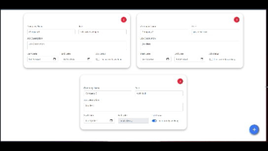
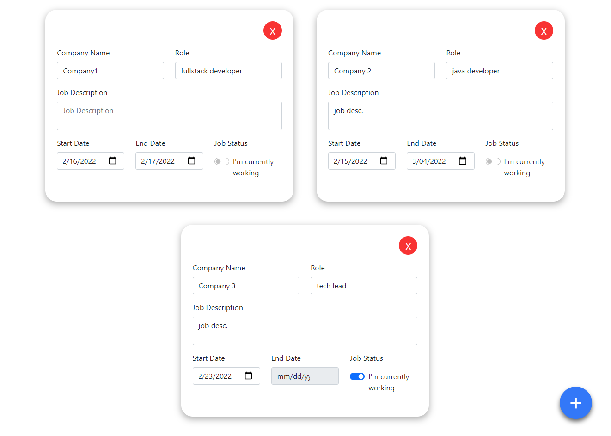
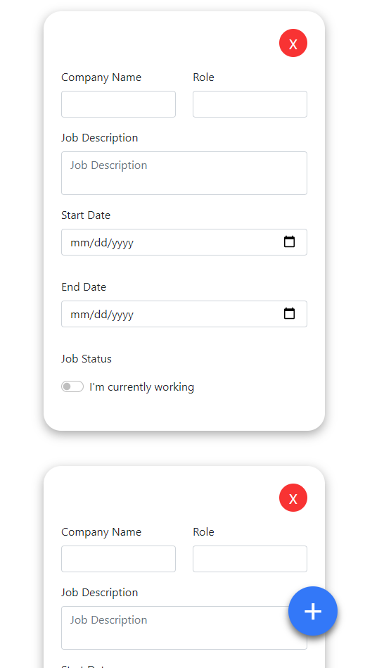

# React JS Dynamic Component With Multiple Inputs

### Branches
- basic (via using useState)
- redux-example (via using redux)

### `npm start`

Runs the app in the development mode.\
Open [http://localhost:3000](http://localhost:3000) to view it in your browser.

The page will reload when you make changes.\
You may also see any lint errors in the console.
